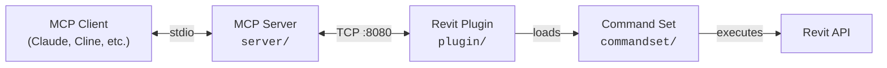

[](https://github.com/mathieucostudio-ui/MCP-REVIT)

# mcp-servers-for-revit

**Connect AI assistants to Autodesk Revit via the Model Context Protocol.**

---

mcp-servers-for-revit enables AI clients like Claude, Cline, and other MCP-compatible tools to read, create, modify, and delete elements in Revit projects in real time. It exposes 138 tools covering project info, model analysis, element creation, batch operations, data export, and more.

> [!NOTE]
> This is a fork of the original [revit-mcp](https://github.com/mcp-servers-for-revit/revit-mcp) project with additional tools and functionality improvements.

## Key Features

- **124 MCP tools** — project info, model health, clash detection, element CRUD, batch operations, data export (PDF/DWG/IFC/CSV)
- **Revit 2023, 2024, 2025, 2026, 2027** — fully tested on all five versions
- **Language-independent** — works with any Revit UI language (English, Italian, French, German, etc.) using BuiltInCategory resolution
- **Built-in Claude chat panel** — dockable panel inside Revit with direct AI access (OpenRouter API, extended thinking enabled)
- **Real-time execution** — AI requests are executed immediately on the active model via TCP/JSON-RPC 2.0
- **Extensible command set** — add new commands without modifying the plugin core

## Architecture



| Component | Language | Role |
|-----------|----------|------|
| **MCP Server** (`server/`) | TypeScript | Translates AI tool calls into JSON-RPC messages over TCP |
| **Revit Plugin** (`plugin/`) | C# | Runs inside Revit, listens on `localhost:8080`, dispatches commands |
| **Command Set** (`commandset/`) | C# | Implements Revit API operations, returns structured results |

## Requirements

### To use

| Requirement | Details |
|-------------|---------|
| **Node.js** | 18+ (for the MCP server) |
| **Autodesk Revit** | 2023, 2024, 2025, 2026, or 2027 |
| **OS** | Windows 10/11 (Revit is Windows-only) |
| **OpenRouter API key** (optional) | Required only for the built-in chat panel. Set via `%USERPROFILE%\\.claude\\openrouter_api_key.txt` or env `OPENROUTER_API_KEY` |

### To build from source

| Requirement | Details |
|-------------|---------|
| **Visual Studio 2022** | With .NET desktop development workload |
| **.NET Framework 4.8 SDK** | For Revit 2023-2024 builds |
| **.NET 8 SDK** | For Revit 2025-2026 builds |
| **.NET 10 SDK** (preview) | For Revit 2027 builds |
| **Node.js 18+** | For the MCP server |
| **Revit API assemblies** | Installed with Revit (referenced automatically via NuGet) |

## Quick Start

### 1. Install the Revit plugin

#### Option A: Automatic install (recommended)

Open PowerShell and paste this command:

```powershell
powershell -ExecutionPolicy Bypass -Command "irm https://raw.githubusercontent.com/mathieucostudio-ui/MCP-REVIT/main/scripts/install.ps1 | iex"
```

The script:
- Detects installed Revit versions automatically
- Downloads the correct pre-built Release from GitHub
- Extracts to the right folder and unblocks all DLLs
- Verifies all dependencies are present
- Checks for Node.js (required for MCP server) and offers to install it
- Configures Claude Desktop if installed

```powershell
# Install for a specific Revit version
.\install.ps1 -RevitVersion 2025

# Install a specific release
.\install.ps1 -Tag v1.2.0

# Uninstall
.\install.ps1 -Uninstall
```

#### Option B: Manual install

> [!IMPORTANT]
> **Download the pre-built ZIP from the [Releases](https://github.com/mathieucostudio-ui/MCP-REVIT/releases) page.** Do NOT clone the repository or copy the source code — the source contains `.cs` files, not compiled `.dll` files. The plugin will not work without compiled binaries.

Extract the ZIP to:

```
%AppData%\Autodesk\Revit\Addins\<your Revit version>\
```

To open this folder quickly, press `Win+R` and type:
```
%AppData%\Autodesk\Revit\Addins
```

After extraction your folder **must** look like this:

```
Addins/2025/
├── mcp-servers-for-revit.addin          <-- manifest file (required)
└── revit_mcp_plugin/                    <-- subfolder (required)
    ├── RevitMCPPlugin.dll               <-- main plugin (required)
    ├── RevitMCPSDK.dll                  <-- SDK dependency (required)
    ├── Newtonsoft.Json.dll              <-- JSON dependency (required)
    ├── tool_schemas.json
    └── Commands/
        ├── commandRegistry.json
        └── RevitMCPCommandSet/
            ├── command.json
            └── 2025/
                ├── RevitMCPCommandSet.dll
                └── ...
```

> [!WARNING]
> If `RevitMCPPlugin.dll` is missing or the `revit_mcp_plugin/` subfolder is not present, the plugin will not load. Check that you extracted the **contents** of the ZIP, not the ZIP file itself.

### 2. Configure the MCP server

**Claude Code**

```bash
claude mcp add mcp-server-for-revit -- npx -y mcp-server-for-revit
```

**Claude Desktop**

Claude Desktop → Settings → Developer → Edit Config → `claude_desktop_config.json`:

```json
{
    "mcpServers": {
        "mcp-server-for-revit": {
            "command": "npx",
            "args": ["-y", "mcp-server-for-revit"]
        }
    }
}
```

### 3. Start Revit

The plugin loads automatically. In the **Add-Ins** ribbon tab you should see **three buttons** in the "Revit MCP Plugin" panel:

| Button | Function |
|--------|----------|
| **Revit MCP Switch** | Start/stop the TCP server |
| **MCP Panel** | Show/hide the built-in chat panel |
| **Settings** | Plugin settings |

Click **"Revit MCP Switch"** to start the TCP server. When the status indicator turns green, the connection is active.

> [!TIP]
> If you only see the **Switch** button but not **MCP Panel** or **Settings**, the plugin did not load correctly. See [Troubleshooting](#troubleshooting) below.


## Supported Revit Versions

| Version | .NET Target | Status | Notes |
|---------|-------------|--------|-------|
| **Revit 2023** | .NET Framework 4.8 | Fully tested | Italian localization verified |
| **Revit 2024** | .NET Framework 4.8 | Built & compatible | Same codebase as R23 |
| **Revit 2025** | .NET 8 | Fully tested | Structural model (Snowdon Towers) |
| **Revit 2026** | .NET 8 | Fully tested | Primary development target |
| **Revit 2027** | .NET 10 | Fully tested | .NET 10 SDK (preview) required |

All tools work across all versions. The command set uses compile-time constants (`REVIT2023`, `REVIT2024`, etc.) to handle API differences between versions (e.g., `ElementId` is `long` in R24+, `int` in R23).

## Supported Tools (124)

### Project & Model Info

| Tool | Description |
| ---- | ----------- |
| `get_project_info` | Project metadata, levels, phases, links, worksets |
| `get_current_view_info` | Active view type, name, scale, detail level |
| `get_current_view_elements` | Elements from the active view filtered by category |
| `get_selected_elements` | Currently selected elements |
| `get_available_family_types` | Family types filtered by category |
| `get_element_parameters` | All instance and type parameters for elements |
| `get_warnings` | Model warnings and errors |
| `get_phases` | Phases and phase filters |
| `get_worksets` | Workset info and status |
| `get_shared_parameters` | Project parameters bound to categories |
| `manage_links` | List, reload, or unload linked Revit models |

### Model Analysis & Auditing

| Tool | Description |
| ---- | ----------- |
| `ai_element_filter` | Intelligent element query by category, type, visibility, bounding box |
| `analyze_model_statistics` | Element counts by category, type, family, and level |
| `check_model_health` | Health score (0-100), grade (A-F), actionable recommendations |
| `clash_detection` | Geometric intersection detection between element sets |
| `measure_between_elements` | Distance measurement (center-to-center, closest points, bounding box) |
| `get_elements_in_spatial_volume` | Find elements within a 3D bounding region |

### Materials & Quantities

| Tool | Description |
| ---- | ----------- |
| `get_materials` | List materials filtered by class or name |
| `get_material_properties` | Physical, structural, and thermal properties |
| `get_material_quantities` | Material takeoffs: area, volume, element counts |

### Element Creation

| Tool | Description |
| ---- | ----------- |
| `create_line_based_element` | Walls, beams, pipes (start/end points) |
| `create_point_based_element` | Doors, windows, furniture (insertion point) |
| `create_surface_based_element` | Floors, ceilings, roofs (boundary) |
| `create_floor` | Floors from boundary points or room boundaries |
| `create_room` | Rooms at specified locations |
| `create_grid` | Grid systems with automatic spacing |
| `create_level` | Levels at specified elevations |
| `create_structural_framing_system` | Beam framing systems within a boundary |
| `create_array` | Linear or radial arrays of elements |

### Element Modification

| Tool | Description |
| ---- | ----------- |
| `modify_element` | Move, rotate, mirror, or copy elements |
| `operate_element` | Select, hide, isolate, highlight, delete |
| `change_element_type` | Batch swap family types |
| `set_element_parameters` | Write parameter values on elements |
| `set_element_phase` | Change element phase assignment |
| `set_element_workset` | Change element workset assignment |
| `match_element_properties` | Copy parameters from source to target elements |
| `copy_elements` | Copy elements between views |
| `delete_element` | Delete elements by ID |
| `load_family` | Load a family file (.rfa) into the project |

### Views & Sheets

| Tool | Description |
| ---- | ----------- |
| `create_view` | Create floor plans, sections, elevations, 3D views |
| `duplicate_view` | Duplicate views (independent, dependent, with detailing) |
| `create_view_filter` | Create, apply, or list view filters |
| `apply_view_template` | List, apply, or remove view templates |
| `override_graphics` | Per-element graphic overrides (color, transparency, lineweight) |
| `color_elements` | Color elements by parameter value |
| `create_sheet` | Create sheets with title blocks |
| `batch_create_sheets` | Create multiple sheets at once |
| `place_viewport` | Place views onto sheets |
| `create_schedule` | Create schedule views with fields, filters, sorting |
| `create_revision` | List, create, or add revisions to sheets |

### Annotation

| Tool | Description |
| ---- | ----------- |
| `create_dimensions` | Dimension annotations between elements or points |
| `create_text_note` | Text note annotations in views |
| `create_filled_region` | Hatched/filled regions in views |
| `tag_all_walls` | Auto-tag all walls in the active view |
| `tag_all_rooms` | Auto-tag all rooms in the active view |

### Data Export

| Tool | Description |
| ---- | ----------- |
| `export_room_data` | All room data (area, volume, department, finishes) |
| `export_elements_data` | Bulk element data export with filtering (JSON/CSV) |
| `export_schedule` | Export schedules to CSV/TXT files |
| `get_schedule_data` | Read schedule contents or list all schedules |
| `batch_export` | Export sheets/views to PDF, DWG, or IFC |

### Batch Operations & Cleanup

| Tool | Description |
| ---- | ----------- |
| `batch_rename` | Batch rename views, sheets, levels, grids, rooms |
| `renumber_elements` | Sequential renumbering of rooms, doors, windows |
| `sync_csv_parameters` | Write parameter values back from CSV/AI data |
| `purge_unused` | Identify and remove unused families, types, materials |
| `cad_link_cleanup` | Audit and clean up CAD imports and links |
| `add_shared_parameter` | Add shared parameters to categories |

### Advanced

| Tool | Description |
| ---- | ----------- |
| `send_code_to_revit` | Execute C# code inside Revit. Variables: `document` (Document), `parameters` (object[]). Auto-imports: System, System.Linq, Autodesk.Revit.DB/UI, System.Collections.Generic. Use `return` to send results. Mode `auto` wraps in Transaction, `none` for manual |
| `store_project_data` | Store project metadata in local database |
| `store_room_data` | Store room metadata in local database |
| `query_stored_data` | Query stored project and room data |
| `say_hello` | Display a greeting dialog (connection test) |

## Built-in Chat Panel

The Revit plugin includes a dockable chat panel that connects directly to the OpenRouter API. It provides a Claude chat interface inside Revit where the AI can autonomously execute tools on the active model.

- **Model**: Claude Sonnet 4.6 with extended thinking (10K token budget)
- **System prompt**: Autonomous mode — Claude executes actions directly without unnecessary confirmations
- **Features**: Tool execution feedback, thinking summary, round progress, stop/cancel, chat export (TXT/MD/JSON)

## Known Limitations

| Limitation | Details |
|------------|---------|
| **Windows only** | Revit runs only on Windows; macOS/Linux are not supported |
| **Single model** | The plugin operates on the active document only; background documents are not accessible |
| **TCP port 8080** | The plugin listens on `localhost:8080`; if the port is occupied, the server won't start |
| **No undo integration** | Operations executed by AI tools create standard Revit transactions but are not grouped into a single undo step |
| **`send_code_to_revit`** | May fail if third-party addins cause assembly conflicts (e.g., duplicate DLL references) |
| **Parameter names are localized** | Revit parameter names depend on UI language. Use BuiltInCategory names (e.g., `OST_Walls`) for categories. The command set resolves categories automatically, but parameter names must match the Revit language |
| **No streaming** | Tool results are returned as a single response; large results (e.g., exporting thousands of elements) may take time |
| **OpenRouter API key** | The built-in chat panel requires an OpenRouter API key. External MCP clients (Claude Code, Claude Desktop) use their own authentication |

## Troubleshooting

### Only the Switch button appears (no MCP Panel or Settings)

**Cause:** The plugin was not installed correctly — usually because source code was copied instead of the pre-built Release, or files are missing.

**Fix:**

1. Close Revit
2. Delete the old installation from `%AppData%\Autodesk\Revit\Addins\<version>\`
3. Download the correct ZIP from the [Releases](https://github.com/mathieucostudio-ui/MCP-REVIT/releases) page
4. Extract and verify the folder structure matches the one shown in [Step 1](#1-install-the-revit-plugin)
5. Restart Revit

### Plugin does not appear in Add-Ins tab

- Verify that `mcp-servers-for-revit.addin` exists directly inside `%AppData%\Autodesk\Revit\Addins\<version>\` (not in a subfolder)
- Verify the ZIP version matches your Revit version (e.g., Revit2025 ZIP for Revit 2025)
- Check that Revit did not block the DLLs: right-click each `.dll` → Properties → if you see "Unblock" at the bottom, check it and click OK

### "Connection refused" when using Claude Desktop or Claude Code

- Ensure Revit is open and the MCP Switch is **ON** (green indicator)
- Check that port 8080 is not used by another application: `netstat -an | findstr 8080`

### Other common issues

| Issue | Solution |
|-------|----------|
| "Element not found" | Verify element ID with `get_current_view_elements` |
| "Parameter not found" | Check exact name with `get_element_parameters` — names are localized |
| "Family type not found" | Use `get_available_family_types` for exact names |
| "Tool not available" in Claude Desktop | Restart Claude Desktop to refresh the MCP tool list |
| Timeout on large operations | Try with fewer elements or a simpler filter |

## Development

### MCP Server

```bash
cd server
npm install
npm run build
```

The server compiles TypeScript to `server/build/`. During development you can run it directly with `npx tsx server/src/index.ts`.

### Revit Plugin + Command Set

Open `mcp-servers-for-revit.sln` in Visual Studio. The solution contains both the plugin and command set projects. Build configurations target Revit 2023-2027:

| Configuration | Target | .NET |
|---------------|--------|------|
| `Debug R23` / `Release R23` | Revit 2023 | .NET Framework 4.8 |
| `Debug R24` / `Release R24` | Revit 2024 | .NET Framework 4.8 |
| `Debug R25` / `Release R25` | Revit 2025 | .NET 8 |
| `Debug R26` / `Release R26` | Revit 2026 | .NET 8 |
| `Debug R27` / `Release R27` | Revit 2027 | .NET 10 |

Building the solution automatically assembles the complete deployable layout in `plugin/bin/AddIn <year> <config>/` — the command set is copied into the plugin's `Commands/` folder as part of the build.

## Testing

The test project uses [Nice3point.TUnit.Revit](https://github.com/Nice3point/RevitUnit) to run integration tests against a live Revit instance.

```bash
# Revit 2026
dotnet test -c Debug.R26 -r win-x64 tests/commandset

# Revit 2025
dotnet test -c Debug.R25 -r win-x64 tests/commandset
```

> **Note:** The `-r win-x64` flag is required on ARM64 machines because the Revit API assemblies are x64-only.

## Project Structure

```
mcp-servers-for-revit/
├── mcp-servers-for-revit.sln    # Combined solution (plugin + commandset + tests)
├── command.json                 # Command set manifest
├── server/                      # MCP server (TypeScript) - tools exposed to AI clients
│   └── src/tools/               # One .ts file per tool (138 tools)
├── plugin/                      # Revit add-in (C#) - TCP bridge + chat panel
│   └── UI/                      # Dockable chat panel (XAML + code-behind)
├── commandset/                  # Command implementations (C#) - Revit API operations
│   ├── Commands/                # Command registration
│   ├── Services/                # Event handlers (one per tool)
│   └── Utils/                   # CategoryResolver, ProjectUtils, etc.
├── tests/                       # Integration tests (TUnit + live Revit)
├── assets/                      # Images for documentation
├── .github/                     # CI/CD workflows
├── LICENSE
└── README.md
```

## Releasing

A single `v*` tag drives the entire release. The [release workflow](.github/workflows/release.yml) automatically:

- Builds the Revit plugin + command set for Revit 2023-2027
- Creates a GitHub release with `mcp-servers-for-revit-vX.Y.Z-Revit<year>.zip` assets
- Publishes the MCP server to npm as [`mcp-server-for-revit`](https://www.npmjs.com/package/mcp-server-for-revit)

```powershell
# Bump version, commit, and tag
./scripts/release.ps1 -Version X.Y.Z

# Push to trigger CI
git push origin main --tags
```

## Acknowledgements

| | Credit | Link |
|---|--------|------|
| **Original concept** | **Roman Zarkhin** — created the first MCP server for Revit (15 tools) | [romanzarkhin/revit-mcp](https://github.com/romanzarkhin/revit-mcp) |
| **Expansion to 80+ tools** | **[mcp-servers-for-revit](https://github.com/mcp-servers-for-revit) community** — lisiting01, jmcouffin, huyan1458, bobbyg603, chuongmep and others expanded the project across three repos | [revit-mcp](https://github.com/mcp-servers-for-revit/revit-mcp), [revit-mcp-plugin](https://github.com/mcp-servers-for-revit/revit-mcp-plugin), [revit-mcp-commandset](https://github.com/mcp-servers-for-revit/revit-mcp-commandset) |
| **Consolidated repo** | **[sparx-fire](https://sparx-fire.com)** (Bobby Galli) — merged the three repos into a single solution | [mcp-servers-for-revit/mcp-servers-for-revit](https://github.com/mcp-servers-for-revit/mcp-servers-for-revit) |
| **Current maintainer** | **LuDattilo** — language-independent operation, embedded Claude chat panel, PowerShell installer | [mathieucostudio-ui/MCP-REVIT](https://github.com/mathieucostudio-ui/MCP-REVIT) |

## License

This project is released under the **MIT License** — see [LICENSE](LICENSE) for the full text.

### What MIT allows

| | Allowed | Condition |
|---|---|---|
| Commercial use | Yes | Include copyright notice |
| Modification | Yes | Include copyright notice |
| Distribution | Yes | Include copyright notice |
| Private use | Yes | — |
| Sublicensing | Yes | Include copyright notice |

### Disclaimer of Liability

> **THE SOFTWARE IS PROVIDED "AS IS", WITHOUT WARRANTY OF ANY KIND.** The authors and contributors are not liable for any damages, data loss, model corruption, or unintended modifications to Revit projects arising from the use of this software. Use at your own risk.

**Important:**

- This software executes commands on live Revit models. Always work on copies or ensure you have backups before using AI-driven automation.
- The AI (Claude or other MCP clients) may misinterpret instructions and execute unintended operations. Review AI-generated actions before confirming batch operations on production models.
- This project is not affiliated with, endorsed by, or supported by Autodesk, Inc. "Autodesk" and "Revit" are registered trademarks of Autodesk, Inc.
